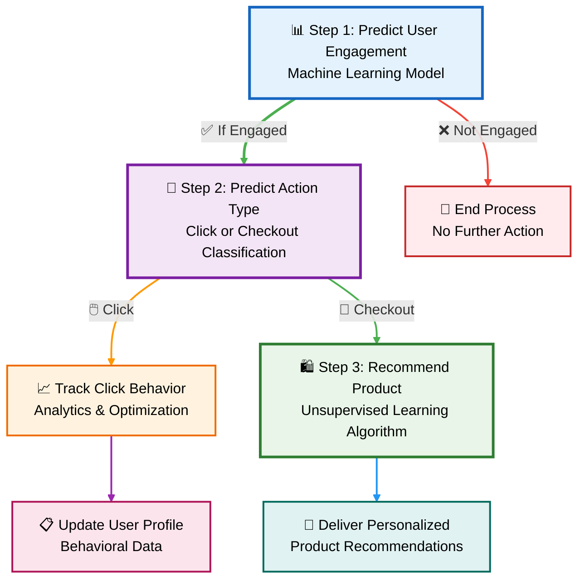

# Pipeline Overview

```mermaid
flowchart TD
    A[📊 Step 1: Predict User Engagement<br/>Machine Learning Model] -->|✅ If Engaged| B[🎯 Step 2: Predict Action Type<br/>Click or Checkout Classification]
    A -->|❌ Not Engaged| D[🚫 End Process<br/>No Further Action]
    B -->|🖱️ Click| E[📈 Track Click Behavior<br/>Analytics & Optimization]
    B -->|🛒 Checkout| C[🛍️ Step 3: Recommend Product<br/>Unsupervised Learning Algorithm]
    C --> F[🎁 Deliver Personalized<br/>Product Recommendations]
    E --> G[📋 Update User Profile<br/>Behavioral Data]
    
    %% Enhanced styling
    style A fill:#e3f2fd,stroke:#1565c0,stroke-width:3px,color:#000
    style B fill:#f3e5f5,stroke:#7b1fa2,stroke-width:3px,color:#000
    style C fill:#e8f5e8,stroke:#2e7d32,stroke-width:3px,color:#000
    style D fill:#ffebee,stroke:#c62828,stroke-width:2px,color:#000
    style E fill:#fff3e0,stroke:#ef6c00,stroke-width:2px,color:#000
    style F fill:#e0f2f1,stroke:#00695c,stroke-width:2px,color:#000
    style G fill:#fce4ec,stroke:#ad1457,stroke-width:2px,color:#000
    
    %% Link styling
    linkStyle 0 stroke:#4caf50,stroke-width:3px
    linkStyle 1 stroke:#f44336,stroke-width:2px
    linkStyle 2 stroke:#ff9800,stroke-width:2px
    linkStyle 3 stroke:#4caf50,stroke-width:2px
    linkStyle 4 stroke:#2196f3,stroke-width:2px
    linkStyle 5 stroke:#9c27b0,stroke-width:2px
```